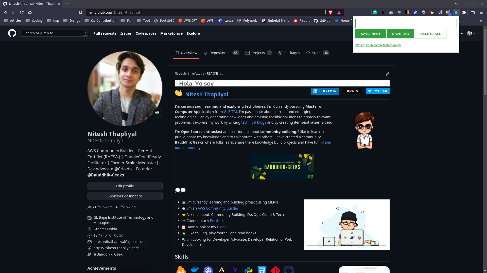

# LinkSaver

LinkSaver is a simple Chrome extension that allows you to save and organize your favorite links. With this extension, you can easily save links from any website and access them later from a convenient pop-up window. The extension is built using HTML, JavaScript, and CSS.

# Installation

- Clone or download the repository
- Open Chrome and navigate to chrome://extensions/
- Turn on developer mode in the top right corner
- Click on the "Load unpacked" button and select the cloned or downloaded repository folder
 The extension should now be installed and available for use
 
# Usage
 
- Click on the extension icon in the top right corner of the Chrome browser
- Enter a name for the link and the link itself in the input fields
- Click on the "Save Input" button to save the input link
- Click the "Save Tab" button to save the link from the opened chrome tab
- Click the "Delete All" button to delete the all links
- To view saved links, click on the extension icon and the links will be displayed in a list
- Click on a link in the list to open it in a new tab

# Contributions
If you have any suggestions or find any bugs, please open an issue or submit a pull request.

# License
This project is licensed under the MIT License - see the LICENSE file for details.